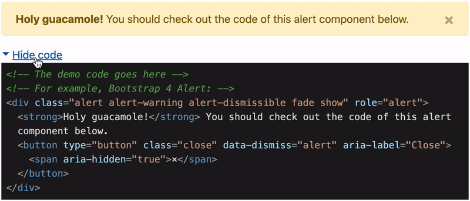

# \<x-ray>

[](http://npm.im/@sneas/x-ray)

Probably, the easiest way to demo HTML/Web components.

Demo: [https://sneas.github.io/x-ray](https://sneas.github.io/x-ray)

## Installation

### HTML

```html
<script src="https://unpkg.com/@sneas/x-ray@3/dist/index.js"></script>
```

### NodeJS

```sh
npm install @sneas/x-ray --save
```

Add import within the root component:

```js
import '@sneas/x-ray';
```

## Usage

```html
<x-ray>
  <code>
    <!-- The demo code goes here -->
    <!-- For example, Bootstrap 4 Alert: -->
    <div class="alert alert-warning alert-dismissible fade show" role="alert">
      <strong>Holy guacamole!</strong> You should check out the code of this
      alert component below.
      <button
        type="button"
        class="close"
        data-dismiss="alert"
        aria-label="Close"
      >
        <span aria-hidden="true">&times;</span>
      </button>
    </div>
  </code>
</x-ray>
```

⚠️ Make sure the code has been wrapped with `<code>` tag.

The result of the code from above:


