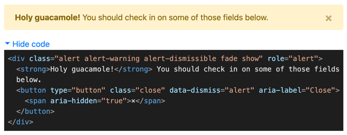

# <component-preview>

Probably, the easiest way to demo HTML/Web components.

Demo: [https://sneas.github.io/component-preview](https://sneas.github.io/component-preview)

## Installation

### HTML

```html
<script
  type="module"
  src="https://unpkg.com/component-preview@latest/dist/component/component.esm.js"
></script>
```

### NodeJS

```sh
npm install component-preview --save
```

Add import within the root component:

```js
import 'component-preview';
```

## Usage

```html
<component-preview>
  <!-- The demo code goes here -->
  <!-- For example, Bootstrap 4 Alert: -->
  <div class="alert alert-warning alert-dismissible fade show" role="alert">
    <strong>Holy guacamole!</strong> You should check in on some of those fields
    below.
    <button type="button" class="close" data-dismiss="alert" aria-label="Close">
      <span aria-hidden="true">&times;</span>
    </button>
  </div>
</component-preview>
```

Which provides the below result:


